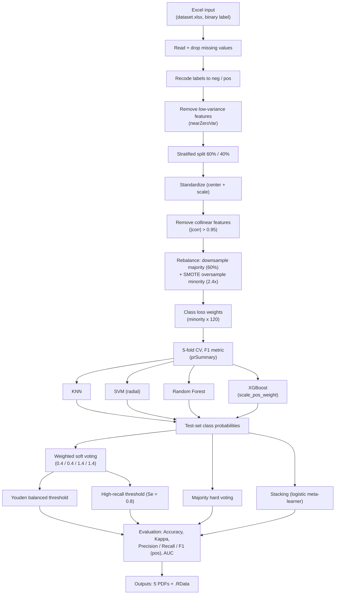

An integrated stacking ensemble machine learning framework for global aquifer functional loss spatial prediction

An end-to-end **R** pipeline for binary classification on **imbalanced tabular data**. It combines feature preprocessing, class rebalancing (majority downsampling + SMOTE), four base classifiers (KNN, SVM, Random Forest, XGBoost) with grid-search hyperparameter tuning under 5-fold cross-validation optimized for the **F1 score**, and three ensemble strategies (weighted soft voting with dual operating thresholds, majority hard voting, and a two-layer stacking meta-learner). All evaluation metrics and publication-ready figures (CV-F1, ROC, PR, feature importance) are exported automatically.

## Pipeline overview



## 1. System Requirements

### 1.1 Operating systems
- **Windows 10 / 11** (64-bit) — primary (the shipped example path is a Windows path)
- **macOS** (Intel or Apple Silicon, 64-bit)
- **Linux** (64-bit; e.g., Ubuntu 20.04 / 22.04)

The script uses only portable R code and runs on any 64-bit platform with R ≥ 4.0 installed.

### 1.2 Software dependencies
- **R ≥ 4.0** (64-bit; R ≥ 4.0 recommended)
- The following R packages are loaded (and auto-installed from CRAN on first run if missing):

| Package | Purpose |
|---|---|
| tidyverse | Data manipulation and pipelines |
| readxl | Read the `.xlsx` input file |
| caret | Modeling framework, preprocessing, cross-validation |
| e1071 | SVM (radial kernel) backend |
| kknn | k-nearest-neighbors classifier |
| randomForest | Random forest classifier |
| xgboost | Gradient-boosted trees (XGBoost) |
| pROC | ROC analysis, AUC, threshold selection |
| themis | SMOTE oversampling for the minority class |
| ggplot2, cowplot, viridis | Plotting (loaded; figures are exported with base graphics) |
| glmnet | Regularized regression (loaded; available for extensions) |
| PRROC | Precision–recall curves |

All packages are taken at their **current CRAN release**; no specific older pin is required.

### 1.3 Versions the software has been tested on
> R 4.1.1 (64-bit) on Windows 10;  dplyr 1.1.4; eadr 2.1.5; forcats 1.0.0; v stringr 1.5.2; ggplot2 3.5.2; tibble 3.3.0; lubridate 1.9.4; tidyr 1.3.1; purrr 1.2.0; xgboost 1.7.7, themis 1.0.0, pROC 1.18.5

The pipeline was written and checked against R ≥ 4.0 with the CRAN package versions current in 2023–2025. With a fixed seed, results are reproducible on a given R version (see Section 5).

### 1.4 Hardware
- **No non-standard hardware required** — no GPU, no special accelerators.
- Recommended for comfortable run times: a standard desktop/laptop with **≥ 8 GB RAM** and **≥ 4 CPU cores** (8 cores recommended). XGBoost and Random Forest use all available cores by default, so run time scales with core count.
- Disk: ≈ 2 GB free for package installation; < 100 MB for pipeline outputs.

## 2. Installation Guide

### 2.1 Install R
1. Download the R installer for your platform from **https://cran.r-project.org** (Windows/macOS) or install via your package manager (Linux: `apt install r-base`).
2. (Recommended) Install **RStudio Desktop** from https://posit.co for a convenient editor.
3. Verify: open R and run `R.version.string` — R ≥ 4.0 is required.

### 2.2 Install the R packages
The script is self-bootstrapping: the first block checks each package and runs
`install.packages(..., dependencies = TRUE)` for anything missing, so **simply running the script installs everything automatically**.

Manual equivalent (if you prefer to install beforehand):

```r
install.packages(
  c("tidyverse", "readxl", "caret", "e1071", "kknn", "randomForest", "xgboost",
    "pROC", "themis", "ggplot2", "cowplot", "viridis", "glmnet", "PRROC"),
  dependencies = TRUE
)
```

> On **Linux**, packages without prebuilt binaries (e.g., `randomForest`, `xgboost`) are compiled from source; this requires a C/C++ toolchain (`build-essential`, `r-base-dev`). On **Windows/macOS** prebuilt binaries are used.

### 2.3 Typical install time (normal desktop computer)
- **Windows / macOS** (prebuilt binaries, broadband): **≈ 10–15 minutes** for all packages and dependencies.
- **Linux** (source compilation of some packages): **≈ 20–40 minutes**.
- If the packages are already installed: **< 1 minute**.

## 3. Demo

### 3.1 Demo data
- Format: Excel `.xlsx`; one row per sample; a **binary label column** (named `type` by default); the remaining columns are numeric features.
- The label must have **exactly two distinct values** — they are recoded internally to `neg` / `pos`.
- Rows containing missing values are removed automatically.

### 3.2 How to run the demo
1. Save the R script, e.g., as `imbalanced_ensemble_pipeline.R`.
2. Point `excel_file_path` to the demo dataset, e.g., `excel_file_path <- "E:/watergap/dataset.xlsx".
3. Run the entire script (or `source("ISEMLF-GFLSP.R")`).

### 3.3 Expected output
**Console (illustrative):**
```
Reading data: Demo_dataset.xlsx
Total samples after removing missing values: 1000
Original positive and negative sample distribution:
 neg  pos
 850  150
Removed low-variance features: feat3,feat17
...
Performing balanced sampling: majority class downsampling + SMOTE oversampling
Training set distribution after sampling:
 neg  pos
 510  360
...
Recommended dual thresholds:
Balanced F1 optimal threshold (Youden): 0.43
High-recall threshold for reducing false negatives: 0.28
Precision/Recall/F1 across full threshold range:
Threshold0.08 | Precision:0.210 | Recall:1.000 | F1:0.347
...
========== Weighted Soft Voting - Balanced Threshold ==========
Accuracy: 0.92 | Kappa: 0.79 | ... | AUC: 0.96
```
(Exact numbers depend on the dataset.)

**Output files (written to the working directory):**

| # | File | Content |
|---|---|---|
| 1 | `1_CV_F1_Score_Comparison.pdf` | Cross-validation F1-score distribution for each model |
| 2 | `2_Multi-model_ROC_Curves.pdf` | ROC curves of KNN / SVM / RF / XGB / Stacking |
| 3 | `3_Multi-model_PR_Curves.pdf` | Precision–Recall curves (key metric for imbalanced data) |
| 4 | `4_RF_Feature_Importance.pdf` | Random Forest variable importance ranking |
| 5 | `5_XGB_Feature_Importance.pdf` | XGBoost variable importance ranking |
| 6 | `Imbalanced_Optimization_Ensemble_ML_Models.RData` | All fitted models and the stacking meta-learner (for later prediction) |

### 3.4 Expected run time (demo, normal desktop computer)
Assumptions: ≈ 1,000–5,000 rows, 10–50 features, 8-core CPU, ≥ 8 GB RAM.

| Stage | Typical time |
|---|---|
| Preprocessing + rebalancing | < 1 min |
| KNN grid search (8 combos × 5 folds) | ≈ 1–2 min |
| SVM grid search (9 combos × 5 folds) | ≈ 1–3 min |
| Random Forest (4 mtry × 5 folds × 400 trees) | ≈ 2–5 min |
| XGBoost grid search (64 combos × 5 folds) — bottleneck | ≈ 5–20 min |
| Voting / stacking / evaluation / figures | < 1 min |
| **Total pipeline** | **≈ 10–30 min (typically ≈ 15 min)** |

Run time scales roughly linearly with rows × features; on a 4-core machine expect about 1.5–2× these figures.

## 4. Instructions for Use

### 4.1 Prepare your data
- Provide an Excel `.xlsx` with a binary label column (default name `type`) and numeric feature columns.
- Ensure the label column has **exactly two classes**; the script recodes them to `neg`/`pos` (set `pos_class` / `neg_class` if you prefer other names).
- Missing values are dropped automatically — clean obvious errors beforehand.

### 4.2 Configure global parameters (top of the script)
| Parameter | Default | Meaning |
|---|---|---|
| `excel_file_path` | `"E:/watergap/dataset1.xlsx"` | Path to the input Excel file — **change to your path** |
| `label_col_name` | `"type"` | Name of the binary label column |
| `train_ratio` | `0.6` | Stratified training-set fraction |
| `cv_folds` | `5` | Number of cross-validation folds |
| `corr_cutoff` | `0.95` | Correlation cutoff for removing collinear features |
| `var_threshold` | `0.01` | Reserved parameter (see note below) |
| `use_balance_sampling` | `TRUE` | Enable majority downsampling + SMOTE |
| `minor_class_weight` | `120` | Loss weight multiplier for the minority class |
| `smote_over_ratio` | `2.4` | SMOTE oversampling ratio for the minority class |
| `major_down_ratio` | `0.6` | Fraction to which the majority class is downsampled |
| `vote_weight` | `c(0.4, 0.4, 1.4, 1.4)` | Soft-voting weights for KNN / SVM / RF / XGBoost |
| `pos_class`, `neg_class` | `"pos"`, `"neg"` | Positive / negative class labels |

> **Note:** low-variance filtering is performed with `caret::nearZeroVar(freqCut = 95/5, uniqueCut = 10)`; `var_threshold` is declared for reference but is not used by the current version of the script.

### 4.3 Run the software on your data
1. Edit `excel_file_path` (and optionally the parameters above) at the top of the script.
2. Make sure the **working directory is writable** — all outputs are written to `getwd()` (use `setwd("your/output/folder")` if needed).
3. Run the whole script. The console prints, in order: data summary → class distributions (before/after rebalancing) → removed features → class weights → best hyperparameters per model → recommended dual thresholds → threshold sweep → per-model and ensemble metrics. The 5 PDFs and the `.RData` model archive are saved automatically.

### 4.4 Notes and troubleshooting
- **Path format:** the default `excel_file_path` is a Windows path. On Linux/macOS use forward slashes and an absolute path (e.g., `"/home/user/data/dataset.xlsx"`).
- **Working directory:** outputs are written to the current working directory — check `getwd()` first.
- **Binary label required:** the label column must contain exactly two levels; otherwise the recoding step fails with an error.
- **PR-curve step:** if `pr.curve()` reports a non-numeric `scores.class1` error, the helper function should pass the numeric negative-class scores (`scores.class1 = neg_scores`); correct that one line and rerun.
- **Console glyphs:** progress messages may display as `???` in some terminals — a display artifact only, it does not affect results.
